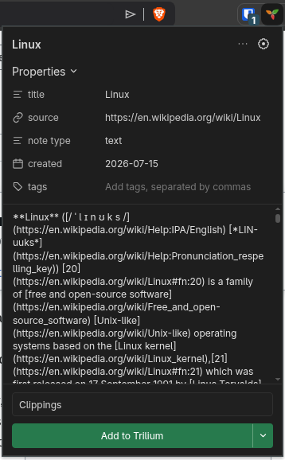

# Trilium Web Clipper - Unofficial

A small, web clipping browser extension optimized for self-hosted Trilium Notes instances. Layout cloned from the popular Obsidian Web Clipper, and also uses Defuddle for markdown generation just like Obsidian Web Clipper. For Chromium based browsers.

## Install

1. In your Trilium instance, create an ETAPI token: **Options → ETAPI**.
2. Visit `chrome://extensions`, enable **Developer mode**, select **Load unpacked**, and choose the unzipped directory.
3. Open the extension’s (right-click)  **Options**, enter your Trilium server address (including port if necessary), paste the token, and select **Test connection**.
4. Clip a selection or page from the toolbar popup, or use the page’s right-click menu.

Trilium stores the result beneath the note marked with the `clipperInbox` label; if none exists, it uses today’s day note. Multiple clips of the same URL and type append to the same note, matching Trilium’s server-side clipper behavior.

## Privacy and security

The server address and token are stored locally in the browser's extension storage. The token is sent only as the `Authorization` header to the configured Trilium server. Prefer HTTPS if the server is reachable beyond your private LAN.

## Scope

- Selection, page, link, and quick-text clips.
- Popup tags are saved as searchable Trilium label attributes; enter multiple tags separated by commas.
- Keyboard shortcut: `Ctrl+Shift+Y` / `Command+Shift+Y`.
- Page clips retain basic HTML and convert relative links/images to absolute URLs. When using the built-in clipper inbox mode, Trilium also handles its normal image processing.
- By default, clips are filed as `Clippings/YYYYMMDD/<clip title>` using Trilium ETAPI. The destination path and date-folder format are configurable in Settings, and the popup can override the custom path for an individual clip. Choose **Trilium clipper inbox** to let Trilium file clips under the note marked `#clipperInbox`, falling back to the current Day Note.
